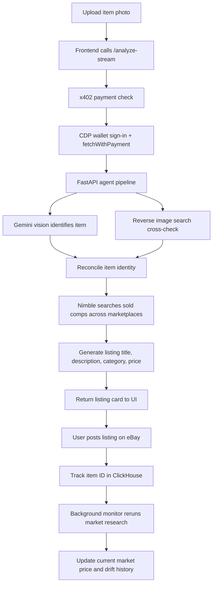

# Pricer

Pricer is an autonomous eBay pricing agent that turns a photo of an item into a market-based listing card, then keeps tracking the item after it goes live. It identifies the item, researches real resale comps on the open web, generates a publish-ready title and description, and stores the live listing in ClickHouse for later drift monitoring.

The primary demo path is the React frontend backed by `server.py`. A legacy Gradio prototype still exists in `app.py`, but the shipped flow is the FastAPI + React stack.

## What It Does

- Takes an item photo from the UI
- Uses Gemini vision to identify the item and generate search keywords
- Cross-checks that identification with reverse image search
- Queries multiple real marketplace sources for sold-price comps
- Generates a ready-to-copy eBay title, description, category suggestion, and price
- Gates the paid analysis route with x402
- Lets the user store the live eBay item ID in ClickHouse
- Re-checks tracked items and records price drift over time

The agent prepares a listing for publication, but the final post to eBay is still manual. Once the item is live, the monitoring loop takes over.

## Agentic Flow



## Sponsor Tools Used

This implementation uses more than two sponsor tools in the shipped system:

- x402 for paid access to the main analysis route
- CDP for wallet setup, sign-in, and x402-enabled fetches in the frontend
- Nimble for live web marketplace research

## Monetization

The main paid action is the `/analyze-stream` endpoint. The frontend signs in with a CDP wallet and uses x402-enabled requests to access the agent. That makes the pricing analysis itself the monetized unit, while tracking and price monitoring stay attached to the stored item record.

If you later want to add a second rail, the current architecture is already compatible with a Stripe-backed or marketplace-distributed top-up flow, but that is not required for the current demo.

## Why This Is Autonomous

- The agent does not rely on a static database of prices.
- It pulls live signals from the open web every time it analyzes an item.
- It runs identification and reverse-image checks in parallel.
- It picks marketplace sources based on the item category.
- It keeps monitoring tracked items after the initial analysis.

## Demo Flow

1. Open the app and sign in with the wallet.
2. Upload a product photo.
3. Trigger analysis and wait for the streamed steps to complete.
4. Review the recommended price and listing copy.
5. Paste the eBay item ID to start tracking.
6. Switch to Tracked Items to show current market price, drift, and history.

## Setup

### Backend

```bash
python -m venv .venv
source .venv/bin/activate
pip install -r requirements.txt
```

### Frontend

```bash
cd frontend
npm install
npm run build
```

### Run

```bash
python server.py
```

## Environment Variables

The full flow expects these values to be available:

- `GOOGLE_API_KEY` for Gemini
- `NIMBLE_API_KEY` for marketplace research
- `IMGBB_API_KEY` and `SERPAPI_KEY` for reverse-image lookup
- `CLICKHOUSE_HOST`, `CLICKHOUSE_PORT`, `CLICKHOUSE_USER`, `CLICKHOUSE_PASSWORD`, `CLICKHOUSE_DATABASE`
- `AGENT_WALLET_ADDRESS` and `X402_PRICE_USDC` for x402 payment configuration
- `VITE_CDP_PROJECT_ID` and `VITE_CDP_USE_MOCK` for the frontend wallet setup

## API Surface

- `POST /analyze-preview` - unprotected preview analysis
- `POST /analyze-stream` - x402-gated streamed analysis
- `POST /track-item` - store a live listing in ClickHouse
- `POST /schedule-check` - schedule a monitoring pass
- `POST /cancel-check` - cancel a pending monitoring pass
- `GET /tracked-items` - list tracked items
- `GET /price-history/{item_id}` - view drift history
- `GET /portfolio-summary` - aggregate tracked-item stats

## Tests

The repository includes unit tests for:

- x402 payment routing
- marketplace source selection
- ClickHouse read/write behavior
- demo price-update helpers

Run them with:

```bash
python -m unittest
```

## Project Layout

- `server.py` - FastAPI entry point and x402-gated analysis route
- `agent.py` - multi-step pricing and listing agent
- `monitor.py` - background price-check scheduler
- `clickhouse_client.py` - ClickHouse schema and persistence helpers
- `marketplace_sources.py` - marketplace selection logic
- `frontend/` - React UI and CDP wallet integration
